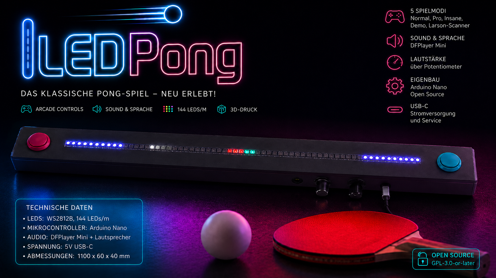
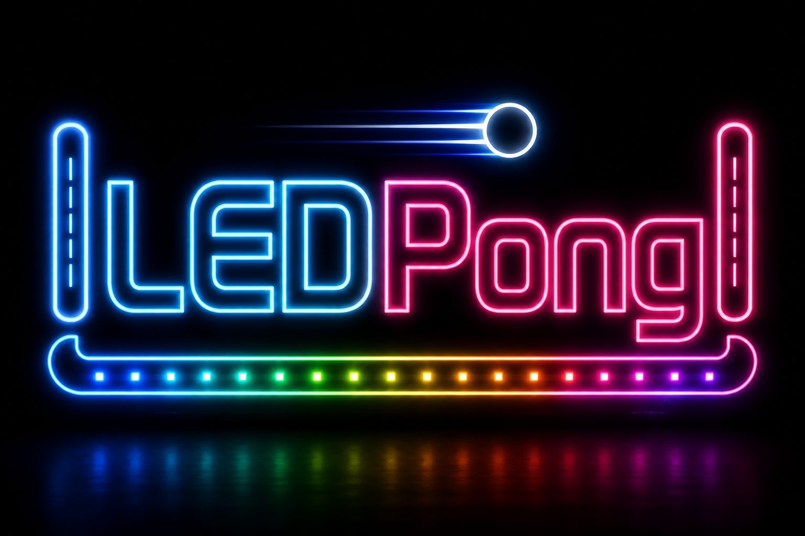

 

# LEDPong

Was ist LEDPong?
LEDPong ist eine moderne Interpretation des klassischen Pong-Spiels.
Gespielt wird nicht auf einem Bildschirm, sondern auf einem 1m langen LED-Strip mit 144 LEDs.
Neben mehreren Spielmodi besitzt LEDPong Sprachansagen, Soundeffekte, Lautstärkeregelung, sowie einen Demo- und einen Scanner-Modus

Besonderheiten
- 🎮 Arcade Mikroschalter Buttons
- 🔊 Gesprochenes Audio and Sound-Effekte
- 🌈 144 LED WS2812B Unterstützung
- 🎚 Lautstärkeregler per Potentiometer
- 🎛 5-fach Wahlschalter für den Spielmodus
- 🤖 Demo mode
- 🚨 Scanner mode
- 🖨 3D-Druck Hardware

 
